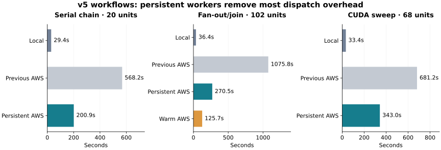

# Persistent SkyPilot workers: v5 benchmark, 2026-09-11

Persistent Misen workers improved cold AWS end-to-end time by **2.0–4.0×** over the previous reusable-VM implementation. Median WorkUnit dispatch-to-bootstrap fell from about **13 seconds to 0.08 seconds**. A fresh fan-out graph on the warm pool needed **125.7 seconds**, with **zero new VM launches, zero environment builds, and zero initial result-cache hits**.

| Workflow | Local | Previous AWS | Persistent AWS, cold | Improvement |
|---|---:|---:|---:|---:|
| Serial chain | 29.4s | 568.2s | 200.9s | 2.83× |
| Fan-out/join | 36.4s | 1075.8s | 270.5s | 3.98× |
| Reduced CUDA sweep | 33.4s | 681.2s | 343.0s | 1.99× |

The cold fan-out figure is **derived**: 258.8s for its first graph plus 11.7s of teardown measured after the warm repeat. The warm graph's 125.7s excludes that shared teardown. The actual two-graph session took 402.2s, including 5.9s between graph timers. Other cold AWS figures directly include teardown. These are bounded overhead benchmarks; cold AWS remains slower than local execution for these short graphs.

## What changed

- SkyPilot provisions VMs and starts one lifetime guard per VM. A persistent Misen agent receives commands over authenticated SSH and launches isolated subprocesses; there is no `sky.exec` or native job-status request per WorkUnit.
- Completion events, local status files, and a cancellation inbox replace synchronous per-job object-store polling. Checkpoints, logs, and results remain durable in the workspace.
- The scheduler counts starting capacity, prepares environments ahead of execution, and uses bounded lookahead plus observed task durations. Serial chains stay on one VM; the fan-out graph provisions both CPU workers before its root finishes.
- One process-owned controller and local API serve the executor session. The same workspace can reuse workers and environments across submissions. `idle_timeout_minutes`, `reuse_workers`, and `close()` bound that lifetime.
- CPU affinity, thread caps, whole GPU reservations, per-device GPU memory checks, and exclusive multi-node groups remain enforced or admitted as appropriate. RAM is an admission budget, not an OS memory limit.

All SkyPilot-specific implementation is in `src/misen/executors/skypilot.py`; the three SkyPilot utility modules were removed. Shared support consists of environment preparation, a generic worker preflight hook, and the result-cache race fix below. The worker protocol uses only Python's standard library and existing SSH tooling.

SkyPilot's documented SSH access is the underlying transport; workers require SSH-accessible Linux VMs or SSH node pools, with Python 3, Bash, `taskset`, and GNU `timeout`. Kubernetes/Slurm command runners are not supported by this transport. [SkyPilot SSH documentation](https://docs.skypilot.ai/en/master/getting-started/quickstart.html#ssh-into-clusters).

## Phase measurements

Seconds unless otherwise specified. Provisioning includes SkyPilot setup and connection establishment; it is not an EC2 allocation-only measurement. Parallel phases overlap and must not be added together.

| Phase | Chain | Fan-out, cold | CUDA |
|---|---:|---:|---:|
| Snapshot creation | 0.413 | 0.417 | 0.520 |
| Local API startup | 4.263 | 4.268 | 4.151 |
| API-ready → controller-ready | 5.790 | 6.305 | 7.306 |
| VM provisioning / Sky setup / SSH connection | 51.3 | 53.8–59.0 | 51.2–60.8 |
| Environment preparation per VM | 57.4 | 61.0–64.7 | 58.6–66.8 |
| Dispatch → bootstrap, median | 0.077 | 0.080 | 0.077 |
| Warm bootstrap → execute entry, median | 0.421 | 0.451 | 0.466 |
| Function imports / payload load, median | 0.021 | 0.023 | 1.376 |
| Execution end → completion observed, median | 0.282 | 0.293 | 0.790 |
| Task function time, summed | 20.006 | 102.022 | 10.477 |
| Result fetch | 5.117 | 24.765 | 2.170 |
| Final session teardown | 10.912 | 11.713 | 12.814 |

Peak concurrent task functions: **1 / 4 / 2**. Fan-out increased from two previously to four, matching its four declared CPU slots. This measures function overlap, not CPU/GPU utilization; the synthetic CPU functions sleep for one second.

The warm fan-out used the same two VMs and one controller/API session. Its dispatch median was 0.081s, completion observation median 0.302s, and result fetch 24.1s. Each command still performs a cached bootstrap and starts a new Python process. Those costs, imports, payload staging, and workspace I/O now account for much of the overhead.

Cold environment preparation took 57–67s in these runs, versus 35–44s previously. These values include dependency retrieval and materialization under the new CPU-affinity controls. The benchmark does not isolate the causes of that difference. The performance improvement comes primarily from dispatch and completion handling.

The conservative lookahead still exposed a substantial GPU cold start: the T4 launch began about 117s after the CPU launches and took another 128s to connect and prepare its environment. This policy improves scheduling without claiming a global runtime optimum.

## Workloads and comparability

- Workflow repository: `PriorComputers/emergent-geometry`, branch **v5**, pinned to `440d009fb9082a71371c79b675861d9919c73eed`, using the same isolated benchmark worktree as the prior run.
- Serial chain: 20 one-second tasks, 19 edges. Fan-out/join: 102 one-second tasks, 200 edges. The harness checks parent identities and returns timing records for every node.
- CUDA sweep: 68 WorkUnits, 108 edges, five variants, eight training steps, batch 8, sequence length 16, model width 32, one layer, four heads, FFN width 64, and checkpoints at steps 4/8.
- All five training outputs reported **Tesla T4**, CUDA execution, finite loss/accuracy, checkpoint step 8, and four metric rows. The task's **8 GiB per-GPU minimum** was resolved from the catalog and checked on the worker. No memory override was used.
- AWS: `us-east-1`; CPU VMs `m6i.xlarge` (4 vCPU/16 GiB physical, 2 CPU/8 GiB declared each); GPU VM `g4dn.2xlarge` (8 vCPU/32 GiB physical, 4 CPU/16 GiB plus one T4 declared). Limits: two CPU VMs and one T4 at most concurrently.
- Local: RTX 3060 with 12 GiB; CPU graphs budget 4 CPUs/16 GiB, training 8 CPUs/32 GiB/one GPU. The local harness checks physical GPU memory before clearing the unsupported scheduler-only `accelerator_memory` field. Task inputs and functions are unchanged.
- Seeds matched across backends: chain 911101, fan-out 911201, training 911302. Warm fan-out used seed 912201 to avoid result-cache hits. Each cold cloud run had fresh VMs and workspace contents.
- Local environments were prepared on the host, with a warm package-download cache, then reused between graphs. Cloud VMs downloaded their dependencies afresh. Python was 3.13.1 locally and 3.13.15 remotely; Torch was 2.12.0+cu126. This is not a hardware-normalized throughput comparison.
- Main local figures use the first standalone run. A second local pass recorded 27.1s / 37.0s / 32.9s; its first two graphs overlapped a test run, so they are supplementary rather than the primary baseline. LocalExecutor's implementation was unchanged.
- Timing starts just before `executor.submit(blocking=True)`, includes snapshots, API startup, provisioning, preparation, execution, result fetch, and final teardown as specified above. Bucket creation and benchmark artifact build/upload are excluded. AWS's later physical termination confirmation is also excluded.
- This is one final cold cloud run per workload and one warm fan-out repeat, not a statistical performance study. Cross-host phase estimates use wall clocks, so subsecond figures are approximate.

## Issues found and validation

The first parallel fan-out attempt exposed an existing cloud result-cache race: concurrent readers publishing the same dependency directory can receive `ENOTEMPTY`, not just `EEXIST`. The store now accepts either only when the winning directory has a manifest, and cleans up the losing temporary directory. A regression test forces two real directory publications to race. The corrected cloud graph completed all 102 WorkUnits; its warm repeat did too.

Fault tests cover subprocess isolation and affinity, individual cancellation, duplicate-dispatch rejection, EOF cleanup, early connection events, multi-node completion barriers, cache publication, idle expiry, cross-graph reuse, parent loss, and ambiguous execution. Final connection-loss handling additionally requires a normal agent-exit acknowledgement before treating interrupted work as retryable: `sky.down` acceptance alone can precede physical VM termination. This conservative failure-path refinement was added after the timed artifact; successful execution and scheduling paths were unchanged.

Validation: **1,164 passed, 53 skipped** in the full suite (eight existing Pydantic deprecation warnings); **65 passed** against SkyPilot nightly 20260911. The benchmark and full suite used the minimum nightly 20260905. Source lint, formatting, type checks, and diff checks passed.

## Evidence and cleanup

All **9 benchmark VMs are terminated** and the temporary S3 bucket is deleted. Archived 4,639 objects (13,770,784 bytes); baseline EC2 states are unchanged.

The failed fan-out attempt and earlier successful chain attempt are retained separately and excluded from the final comparison. All raw evidence is private under:

`/home/apoorvkh/workspace/emergent-geometry-bench-20260911/.cache/benchmark-20260911-persistent`

That directory contains run JSON, controller and per-node diagnostics, local logs, object-store archives, EC2 timelines, versioned benchmark wheels/source hashes, and cleanup records. Instrumentation is confined to the staged benchmark copy. Raw files can contain private transport URLs and must not be published wholesale.

Shareable aggregates: [skypilot-persistent-v5-2026-09-11.json](skypilot-persistent-v5-2026-09-11.json). Prior results: [reusable-VM benchmark](skypilot-reusable-v5-2026-09-11.md).
