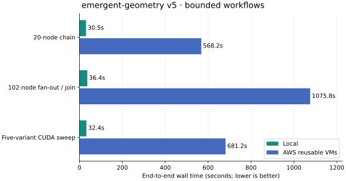

# Reusable SkyPilot workers: emergent-geometry v5

Measured on September 11, 2026, using `PriorComputers/emergent-geometry` v5 at
`440d009fb9082a71371c79b675861d9919c73eed` and the Misen working tree based on
`6f7cd416993118c03f4bcb9f80476b17567be3a9`. The isolated workflow checkout is
`/home/apoorvkh/workspace/emergent-geometry-bench-20260911`; the existing
emergent-geometry checkout was preserved.

The bounded suite completed locally and on AWS with zero initial result-cache hits.

| Workload | Local | AWS | AWS / local | Worker VMs |
| --- | ---: | ---: | ---: | ---: |
| Chain | 30.5s | 568.2s | 18.6× | 1 |
| Fanout | 36.4s | 1075.8s | 29.5× | 2 |
| Training | 32.4s | 681.2s | 21.0× | 3 |



Single-run observations; medians below are across WorkUnits within a run.

| AWS phase | Chain | Fan-out | Training |
| --- | ---: | ---: | ---: |
| Snapshot preparation | 0.44s | 0.41s | 0.37s |
| API startup | 4.25s | 4.25s | 4.25s |
| Credential / catalog preflight | 6.31s | 6.54s | 7.37s |
| VM provisioning / SkyPilot setup (each worker) | 57.4s | 53.2s, 54.4s | 84.1s, 78.3s, 60.8s |
| First bootstrap per VM | 43.56–43.56s | 42.22–42.59s | 35.38–38.98s |
| Later bootstrap median | 0.45s | 0.45s | 0.51s |
| Dispatch → bootstrap median | 13.18s | 12.87s | 13.20s |
| Execution end → controller completion median | 5.62s | 10.97s | 14.23s |
| Payload imports / deserialization median | 0.02s | 0.02s | 1.58s |
| Actual function time, sum | 20.00s | 102.03s | 9.87s |
| Peak overlapping function calls | 1 | 2 | 2 |
| Result retrieval | 4.85s | 24.49s | 2.27s |
| Final cleanup wait / close | 6.41s | 0.00s | 9.61s |

Phase intervals can overlap, especially provisioning the second worker while
the first worker executes branches. These rows are not an additive breakdown.
The private run records retain individual WorkUnit timings and all five CUDA
training results. Machine-readable aggregates are in
[the accompanying JSON](skypilot-reusable-v5-2026-09-11.json).

The first successful CUDA run, before the retirement fix, took **702.5s** and
launched four worker VMs over its lifetime (three CPU allocations and one T4),
while never exceeding two CPU workers and one GPU worker concurrently. The
corrected run took **681.2s** and used three VMs total (two CPU and one T4),
with no premature retirement. CPU provisioning varied from roughly 52–56s in
the first run to 78–84s in the corrected run. The total-time difference is a
single-run observation; eliminating the replacement VM is the direct evidence
for the scheduler fix. Both runs completed all 68 WorkUnits and all five CUDA
variants with zero initial result-cache hits, step-4/8 checkpoints, four metric
rows per variant, and finite final loss and accuracy.

## Implications for the executor

Reusable VMs successfully avoid repeated provisioning and environment builds.
The serial graph uses one VM, and the fan-out graph scales to two. However,
short functions still pay the native SkyPilot job startup and completion path
for every WorkUnit. On the chain, median dispatch-to-bootstrap is 13.18 seconds
and median execution-end-to-controller-completion is 5.62 seconds, compared
with about one second inside each function. Warm bootstrap itself has a
0.45-second median, including an approximately 3-millisecond environment check.

The next design change to investigate is a persistent Misen worker process
on each VM, launched once through SkyPilot. That worker could accept ready
WorkUnits through a lightweight queue or connection and report completion
without creating a native SkyPilot job for each WorkUnit. The current worker
list, resource budgets, GPU-memory eligibility, dependency scheduling, and
teardown ownership can remain the configuration and scheduling model. This is
a recommendation from the measurements, not a benchmark of that future design.

Smaller follow-ups include reducing synchronous control-plane polling,
batching short compatible tasks, and overlapping worker/environment startup
with known upcoming parallel or GPU stages. Ready-only provisioning avoids
allocating speculative workers but delays the second fan-out VM until the
root completes. A launch policy using measured startup times and task-duration
estimates could trade bounded idle time for lower graph makespan. Prebuilt
environments could reduce cold bootstrap; they would address a different
part of the measured overhead from per-WorkUnit dispatch.

Longer training runs may amortize these costs much better. The reduced sweep
and one-second proxies establish deployment and orchestration behavior; they
do not establish an AWS/local ratio for full training configurations.

## Workloads and comparison

| Workload | Graph | Actual task work |
| --- | --- | --- |
| Chain | 20 WorkUnits, 19 edges | One second of sleep per node |
| Fan-out/join | 102 WorkUnits, 200 edges | Root, 100 branches, join; one second per node |
| CUDA training | 68 WorkUnits, 108 edges; five GPU WorkUnits | Five real variants, eight training steps each, plus CPU preparation and analysis |

The synthetic graphs measure orchestration, not CPU throughput. The reduced
training configuration uses batch size 8, sequence length 16, model dimension
32, one layer, four heads, and checkpoints at steps 4 and 8. It exercises the
full five-variant graph and artifact flow, not model quality or sustained GPU
throughput. CUDA is required; a CPU fallback fails the run.

Local execution uses one RTX 3060 with 12 GiB device memory, a four-CPU/16-GiB
budget for synthetic graphs, and an eight-CPU/32-GiB budget plus one GPU for
training. AWS uses on-demand instances in us-east-1 with these worker entries:

```python
workers = [
    dict(infra="aws/us-east-1", instance_type="m6i.xlarge", cpus=2, memory=8, max_workers=2),
    # Included only for the training graph:
    dict(infra="aws/us-east-1", instance_type="g4dn.2xlarge", cpus=4, memory=16, accelerators={"T4": 1}, max_workers=1),
]
```

The CPU machines physically have four vCPUs/16 GiB each; the GPU machine has
eight vCPUs/32 GiB. Smaller scheduling budgets leave OS/SkyPilot headroom.
Global worker bounds are two for synthetic graphs and three for training.
The idle timeout is three minutes. Workers retire sooner when no remaining
WorkUnit can use them. Each graph starts with fresh VMs and a fresh private
S3 workspace; reuse occurs within a graph, not across submissions.

The first successful training run set `accelerator_memory={"T4": 14}`,
a conservative GiB/device declaration. AWS's instance-type API reports 16 GiB
nominal memory for this T4; the [provider specifications](https://docs.aws.amazon.com/ec2/latest/instancetypes/ac.html)
document the instance family. The initial catalog query included CPU rows and
returned missing GPU-memory metadata. The production fix queries GPUs only
for GPU backends, recovering the 16-GiB value without an override. The corrected
training rerun uses this automatic catalog detection. The first measured T4 reports
15,360 MiB (15 GiB) through nvidia-smi, using NVIDIA driver 580.159.04;
this exceeds the 8-GiB Task minimum.

All successful local/cloud pairs use matching input seeds, separate storage,
and zero initial WorkUnit result-cache hits. Training declares an 8-GiB
per-device GPU-memory requirement. SkyPilot checks catalog eligibility and
assigned device memory. LocalExecutor currently rejects this constraint, so
the benchmark checks the physical local GPU's capacity before clearing only
the scheduler's WorkUnit memory field. Task functions and inputs are retained.

## Measurement boundaries

- End-to-end time starts immediately before `executor.submit(blocking=True)`
  and includes result retrieval and executor closure. Graph construction,
  SDK/dependency installation on the submitting host, and initial creation of
  the benchmark bucket are excluded.
  AWS may continue transitioning from shutting-down to terminated after the
  SDK teardown returns. EC2 termination confirmation is tracked separately
  and is outside each reported end-to-end interval. The corrected training
  rerun began CPU startup while the previous T4 was finishing shutdown; the
  previous T4 terminated before the next GPU allocation began.
- Snapshot preparation is timed inside submission. Local prewarming remains
  enabled by default; its time is included in snapshot preparation. The first
  local graph builds a fresh environment using an already populated uv
  download cache; later local graphs reuse that environment.
- API startup measures spawning the foreground API through its health check.
  Credential/catalog preflight follows. No remote API server or controller
  VM is used.
- Provisioning measures the native launch request through controller-observed
  readiness. It includes allocation, SSH availability, SkyPilot runtime setup,
  and completion polling. EC2 states were sampled every three seconds to
  distinguish machine launch from the broader ready interval approximately.
- Bootstrap measures entry to the remote bootstrap shell through entry to
  Misen's execution module. Environment materialization is a subinterval.
  Fresh AWS machines download dependencies. A second concurrent first-wave
  job can wait on the same environment build; the fan-out run includes such
  a later bootstrap of about 40 seconds, despite a 0.45-second median. Their cold bootstrap is not
  directly comparable to the local machine's warm download cache.
- Function time surrounds actual task function calls. WorkUnit time also
  includes dependency resolution, serialization, and workspace I/O. Function
  sums overlap when tasks run in parallel and must not be added to wall-time
  phase intervals. Peak concurrency describes overlapping function calls,
  not reserved scheduler slots or CPU utilization.
- Dispatch-to-bootstrap spans controller dispatch through remote shell entry;
  it includes SDK, SSH, native scheduling, and process-start costs. Cross-host
  intervals use wall clocks; within-process intervals use monotonic clocks.
- Timing probes are confined to a private Misen source/wheel copy. Remote
  native logs are periodically archived by SSH; this adds a small unquantified
  monitoring cost. Raw logs can contain private bootstrap URLs and remain in
  the private evidence directory, rather than this report.

The host uses Python 3.13.1. Remote environments resolve Python 3.13.15 from
the project's compatible Python constraint. PyTorch is 2.12.0+cu126.
Cloud runs use skypilot-nightly 1.0.0.dev20260905. The CPU graphs have one successful execution per backend; the CUDA graph has
one local execution and two successful AWS executions across the scheduler
fix. These are not repeated samples of a fixed implementation or a
hardware-normalized speed comparison.

## Integration fixes discovered during the run

Four unsuccessful cloud attempts preceded the measured chain; none created
a VM. They exposed a string-subclass SDK request ID that msgspec could not
serialize, missing enabled-cloud state in an isolated runtime, an AWS CLI
installed beside Python but absent from PATH, and a missing host rsync binary.

Misen now normalizes persisted SDK request IDs to plain strings, checks the
declared clouds inside each fresh runtime, and puts the active interpreter's
binary directory on the child PATH. The benchmark installs rsync in its own
private tools directory. Host SSH/rsync requirements are documented.

The first training attempt also failed before provisioning because of the
catalog-query issue described above; it is excluded from the timings.

A further cleanup fix waits on an already-issued down request when closing a
draining worker. Closing a completed graph also now permits normal draining
without recording a controller failure. This diagnostic cleanup change is
included in the corrected training run. The duplicate-down fix is included in the fan-out and training artifacts; the
chain artifact predates that cleanup-only change. The fan-out and training harnesses also
wait up to 60 seconds for natural teardown before calling close, recording
that wait. These differences affect cleanup accounting, not task execution.

The mixed workflow also exposed unnecessary CPU-worker retirement: the
controller freed a CPU slot for pending GPU work even though the only allowed
GPU worker was already provisioning or occupied. The fix excludes WorkUnits
already reserved against provisioning capacity, checks per-type limits before
replacing an idle worker, and permits only one replacement drain at a time.
Regression tests cover preserving CPU capacity and avoiding excess drains.
The corrected mixed-workflow run measures this fix on AWS.

After the first successful CUDA graph, EC2 still reported its T4 as
shutting-down 270.6 seconds after the run finished SDK cleanup; a later check
confirmed termination at 362.0 seconds. This observation brackets the extra
shutdown delay and is not included in the reported 702.5-second workflow time.

## Reproduction and evidence

The isolated v5 checkout contains `scripts/benchmark_reusable.py`,
`scripts/instrument_misen.py`, `scripts/refresh_misen.sh`,
`scripts/collect_worker_logs.py`, and `scripts/analyze_reusable.py`, plus the
small workflow adaptations. These scripts use this machine's paths and are
retained as the exact executed harness, rather than a portable benchmark API.

Evidence lives under that checkout's `.cache/benchmark-20260911/`: run records,
controller checkpoints, API/native logs, EC2 timelines, content-addressed
instrumented wheels, source fingerprints, archived workspace objects, and
cleanup verification. Successful run labels identify the measured executions;
failed attempts are retained separately and excluded from their timings.

## Code validation

After the benchmark-driven fixes, the full Misen test suite passed:
1,156 passed, 53 skipped, with eight pre-existing Pydantic deprecation warnings.
The 58 targeted SkyPilot tests also passed on nightly 20260911; the full suite
uses the minimum nightly 20260905. The tests include real local API startup,
shutdown, parent-loss cleanup, and the mixed CPU/GPU catalog regression.
Source linting, formatting, and type checking passed.

## Cleanup

All **10 benchmark VMs** across successful runs are terminated. The temporary
S3 bucket is deleted, with **3,264 objects (23,149,956 bytes)** archived locally.
All ten pre-existing EC2 instances retain their baseline states. The six root
volume IDs recorded while their VMs were alive were explicitly checked and
are deleted. No owned SkyPilot API processes remain. Three-second EC2 samples
observed at most two pending/running CPU instances and one pending/running GPU
instance throughout the suite.

After outputs and worker logs were retained, final cleanup reissued termination
for the remaining disposable instance with `Force=True, SkipOsShutdown=True`.
This was benchmark cleanup, outside the measured workflow interval. AWS's
[termination API](https://docs.aws.amazon.com/AWSEC2/latest/APIReference/API_TerminateInstances.html)
documents these options. Raw cleanup inventories, volume checks, and resource
audits are retained with the private evidence.
