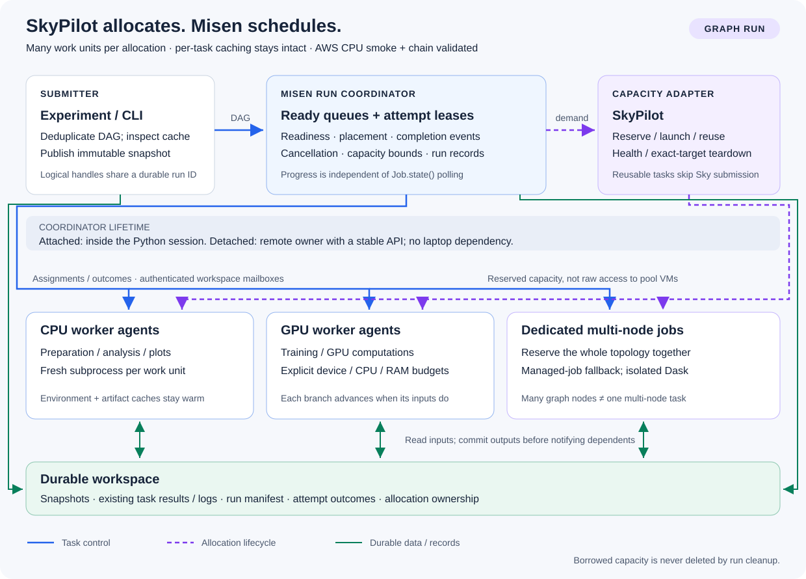
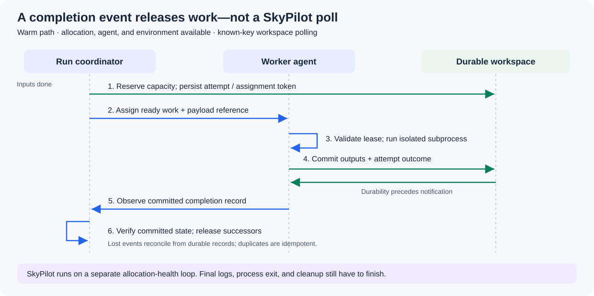

# Graph-aware SkyPilot execution

Status: **implemented replacement, pending AWS integration validation**.
The earlier staged rollout and eager managed-job default are superseded. There
is one graph execution architecture, with no `execution` switch. See the
[SkyPilot guide](skypilot.md) for supported configuration and lifecycle examples.

## Architecture

SkyPilot manages compute allocations; Misen schedules ready work units inside
them. A reusable agent executes many work units without a SkyPilot submission
for every node. Explicit dedicated profiles handle multi-node and other work
that needs its own native allocation.

| Component | Responsibility |
| --- | --- |
| Submitter | Cache discovery, immutable snapshot and graph, logical handles |
| Coordinator | Dependency counts, ready queues, bounded placement, attempts, cancellation, cleanup |
| Capacity adapter | Native launch/status/cancel and durable allocation identities |
| Agent | Finite lease, one fresh subprocess at a time, device visibility, process outcomes |
| Workspace | Existing caches/payloads plus known-key control and outcome records |

An attached coordinator runs in a thread inside the invoking Python process.
It advances independently of `Job.state()` and UI polling. Blocking SkyPilot
calls run outside its loop, bounded in number by configured capacity. The same
scheduler can run remotely in an explicit detached coordinator allocation.

Agents run inside SkyPilot reservations, not by discovering pool machines and
bypassing their scheduler. Pools use `sky.jobs.launch(pool=...)`, existing clusters
use `sky.exec()`, and owned infrastructure uses managed jobs. Dedicated jobs are
launched only after their dependencies finish.

## Transport and execution

The implemented transport uses authenticated workspace JSON mailboxes, polling
known keys rather than listing buckets. The default interval is 0.2 seconds;
actual latency includes object-store requests and interpreter startup. Slower
SkyPilot health polling does not drive normal dependency release.

This replaces the original proposal's SSH-forwarded channel, avoiding private
SkyPilot pool-connection APIs and inbound access to the submitter. The tradeoff
is object-store latency and request volume. Transport remains separate from
dependency scheduling so it can be optimized without changing graph semantics.

1. Discover cached work, stage task/agent payloads, and publish the pending DAG.
2. Return logical handles, including nodes waiting on dependencies or capacity.
3. Assign only ready nodes, persisting attempt identity before sending commands.
4. Claim attempts durably before subprocess creation and again before callable
   execution; duplicate or uncertain claims never automatically replay code.
5. Execute the existing work unit, retaining environment/artifact caches, task
   locks, cache rechecks, result serialization, and task grouping.
6. Publish callable completion and release successors when that record is read,
   without waiting for native SkyPilot completion. Track process exit and log
   draining separately; late failures are reported without deleting valid results.
7. Reuse the idle agent for the next compatible ready node.

Run IDs, logical job IDs, attempt IDs, native allocation IDs, and worker
generations are distinct. Stale outcomes cannot complete a new attempt. Public
job states remain `pending/running/done/failed/unknown`, with a coalesced run index.
Failures propagate to descendants, not unrelated branches.

There is no automatic retry, coordinator takeover, or uncertain replay.
`attach()` reconstructs observation/cancellation handles, not scheduling ownership.
A durable owner record rejects remote coordinator restart. Missing heartbeats
expose uncertainty, not proof that code never ran. Across independent runs,
existing cache locks remain, but agents and active logical jobs are not shared;
non-cacheable work may execute twice. Arbitrary side effects are not exactly-once.

The workspace is trusted. Executable payloads/work-unit pickles must not be loaded
from untrusted submissions. JSON control records do not contain raw credentials;
project environment files and workspace configuration retain the existing snapshot
trust contract. Scope workspace IAM appropriately.

## Placement and lifecycle

Capacity profiles declare reservations, not inferred pool inventory. SkyPilot
validates native resource availability. Misen matches CPU, memory, node count,
accelerator backend/count, and declared per-device memory. It prefers CPU-only
capacity for CPU work, then reusable and smaller fitting shapes. Unfit requests
fail before submission. Time limits are not runtime estimates.

Each agent runs one subprocess. Thread limits and supported device masks are
cooperative controls, not cgroup/security isolation. Masks preserve actual
SkyPilot-assigned IDs and fail closed for unsupported or insufficient visibility.
Multi-node profiles are dedicated; `DASK_CLIENT` tasks require an exact node-count
match, with Dask scoped to that work unit rather than the global scheduler.

| Lifecycle | Owner | Submitter exit |
| --- | --- | --- |
| Attached, default | Coordinator in a live session | Cancel unfinished work, drain, stop owned local API lifecycle |
| Detached | Dedicated remote coordinator and stable remote API | May exit after native coordinator acceptance |

`Experiment.run()` defaults to waiting for attached SkyPilot runs. Nonblocking
attached `submit()` needs `with executor.session():`; it does not implicitly
detach. Other executors keep their existing default.

Detached runs require a stable remote API with supported temporary service-account
injection, and a compatible SkyPilot SDK in the snapshot runtime. The remote entry
point checks injected endpoint/credentials before cloud work. Native acceptance
does not guarantee remote bootstrap success.

Run, setup, execution, and shutdown limits are separate. Execution timing starts
when callable-start is observed, excluding dependency waiting and environment
setup; observation latency is not a hard real-time bound. Native commands also
have finite outer lifetimes. Agent leases renew every 10 seconds and expire after
60 seconds, followed by bounded process-group termination. Storage operations
must themselves have finite timeouts: a deadline cannot interrupt an arbitrarily
blocked object-store client.

A per-attempt process guard watches an agent-owned pipe and terminates the
payload group on agent death, even if the agent's cleanup handler cannot run.
It also has its own hard deadline. This covers ordinary descendants, not code
that escapes the group by daemonizing or a forcibly killed guard. An observed
agent-generation change retires the allocation instead of admitting more work
beside a potentially uncertain old attempt. Logical results can become done
before draining, but the run index becomes terminal only after coordinator cleanup.

Cancellation targets this run's jobs only. Cancelling a task leaves its reusable
agent available for independent work. Cleanup reports unresolved launches and
cancellations, retaining native names/IDs for inspection. Borrowed pools/clusters
are never resized or terminated. Owned workers use SkyPilot managed-job teardown;
shared managed-jobs controllers and their disks may remain billable. Stopping a
local API server does not prove that every cloud resource has been removed.

## Validation and remaining optimization

The previous September 5 AWS smoke pair on `emergent-geometry` v5 took 216.5
seconds cold and 113.2 seconds warm for two functions lasting 0.45–0.61 seconds.
Those are motivation, not measurements or claimed speedups for this replacement.

Hermetic tests cover DAG readiness/scale, cache integration, config/lifecycle,
subprocess agents, masks, duplicate claims, generation changes, cancellation
isolation, native recovery, and bounded cleanup. A real local subprocess test
completes a dependent graph without `Job.state()` calls. Another test completes
20 logical tasks with one native worker allocation.

AWS validation remains necessary: capped cold/warm CPU smoke, chain, fan-out/join,
CPU→GPU→CPU, multi-node Dask, detached completion after submitter exit, failure
injection, and exact teardown. Measure ready-to-start and result-to-successor
latency, environment builds, native submissions, makespan, and allocated resources.

Not implemented: automatic worker replacement, concurrent slots, dynamic scaling,
critical-path priority, locality scoring, shared cross-run agents, or takeover.
Next optimizations should follow measurement: reduce mailbox requests/state
serialization, consider a lower-latency channel, improve critical-path routing,
and prewarm near-ready capacity. Automatic replay needs fencing at assignment,
record updates, and result publication before it can safely be enabled.
